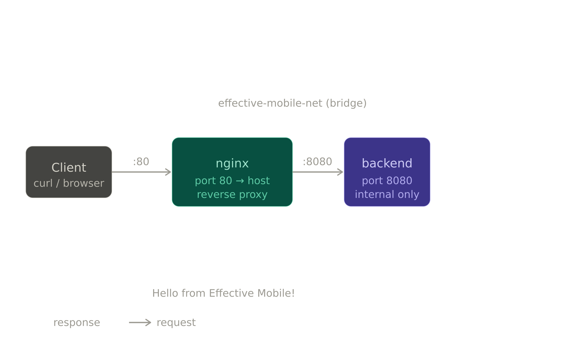

# Effective Mobile — DevOps Test Task

Simple web application: Python HTTP backend behind an nginx reverse proxy, running in Docker containers.

---

## Architecture



## Tech Stack

| Component     | Technology              |
|---------------|-------------------------|
| Backend       | Python 3.12 (http.server) |
| Reverse proxy | nginx 1.27 Alpine       |
| Orchestration | Docker Compose v3.9     |

---

## Project Structure

```
.
├── backend/
│   ├── Dockerfile      # slim Python image, non-root user, healthcheck
│   └── app.py          # HTTP server on port 8080
├── nginx/
│   ├── Dockerfile      # custom nginx image, non-root user
│   └── nginx.conf      # reverse proxy config with upstream block
├── docker-compose.yml  # orchestration, isolated bridge network
├── .env.example        # environment variable template
├── .gitignore
└── README.md
```

---

## Quick Start

### Prerequisites

- [Docker](https://docs.docker.com/get-docker/) >= 24
- [Docker Compose](https://docs.docker.com/compose/) >= v2

### 1. Clone the repository

```bash
git clone https://github.com/Belochka228/effective-mobile-devops.git
cd effective-mobile-devops
```

### 2. Configure environment

```bash
cp .env.example .env
```

Default values work out of the box. Edit `.env` if port 80 is already in use.

### 3. Build and start

```bash
docker compose up --build -d
```

### 4. Verify

```bash
curl http://localhost
```

Expected output:

```
Hello from Effective Mobile!
```

### 5. Stop

```bash
docker compose down
```

---

## How it works

1. **nginx** listens on port 80 (mapped to the host).
2. Every request to `/` is forwarded via `proxy_pass` to the `backend` service using Docker internal DNS — service name `backend`, port `8080`.
3. **backend** Python server receives the request and responds with `Hello from Effective Mobile!`.
4. The response travels back through nginx to the client.

The backend is **not reachable from the host** — isolated inside the `effective-mobile-net` bridge network.

---

## Security

- Both backend and nginx run as **non-root** users
- Backend port is **not published** to the host
- No secrets stored in the repository
- Minimal base images to reduce attack surface